# StrikeCaller

**Hear the combo. Set the pace. Build the reaction.**

StrikeCaller is a complete local-first spoken combo coach for **Boxing** and **Muay Thai**. It calls realistic combinations during shadowboxing, bag work, pad work, or solo drills — with adaptive pacing, timed rounds, and training stats that stay in the browser.

Current release: **1.4.0**. See [CHANGELOG.md](./CHANGELOG.md) for what’s new.

<p align="center">
  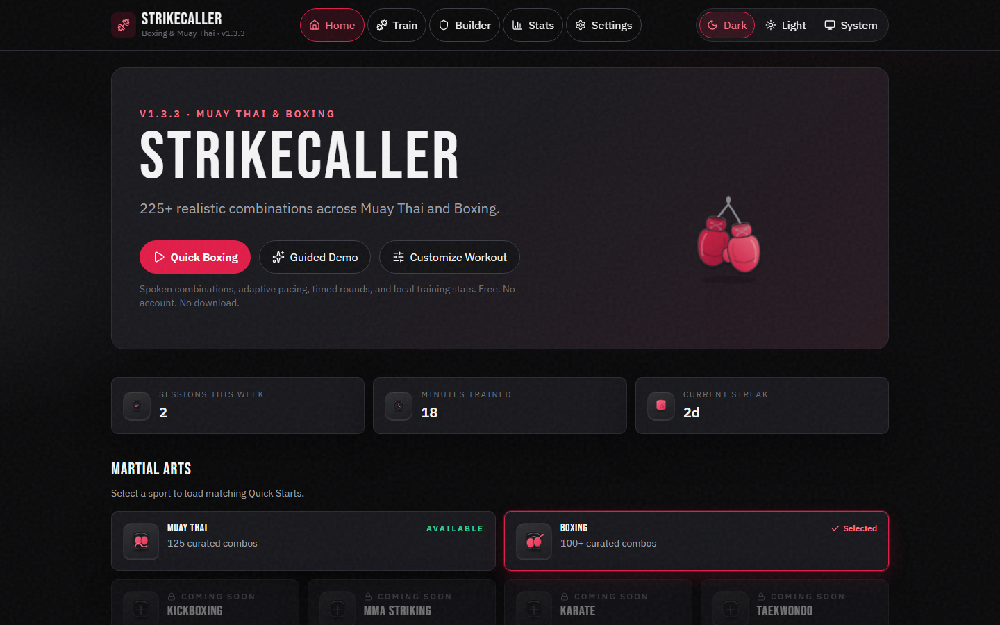
</p>

<p align="center">
  <a href="https://manpreets2.github.io/StrikeCaller/"><strong>Live Demo</strong></a>
</p>

| | |
|---|---|
| **Live** | [GitHub Pages](https://manpreets2.github.io/StrikeCaller/) |
| **Stack** | React · TypeScript · Vite |
| **Quality** | 722 Vitest / 47 files · 86 Playwright passed / 36 skipped / 0 failed |
| **Browsers** | Chromium · Firefox · WebKit · Mobile WebKit |
| **Storage** | IndexedDB + localStorage |
| **Privacy** | No account · No backend · Privacy-first anonymous site analytics · No cloud sync |
| **Release** | v1.4.0 candidate |

**225** curated combinations (**125** Muay Thai, **100** Boxing). Free. No account.

StrikeCaller tracks training activity, not technique quality or accuracy.

## Why I built it

Most combo timers treat every strike the same. A jab and a rear body kick do not deserve the same pause. Random technique strings also ignore stance, weight transfer, range, and safe exits.

StrikeCaller is built so every call is trainable — curated first, generated only under explicit compatibility rules, and spoken on a pace that respects the technique.

## What it does

- **Spoken coaching** — names, boxing numbers, or hybrid calls via the Web Speech API, with on-screen captions if speech is unavailable
- **Training modes** — Learn, Coach, Round, Reaction, Daily Drill, Custom Combo Builder, and a 60-second Guided Demo
- **Adaptive timing** — each technique carries execution, recovery, and transition timing; kicks and committed strikes get more time than jabs
- **Stance-aware** — orthodox and southpaw as first-class; lead/rear by default, optional left/right
- **Local stats** — session history, streaks, and durable workout summaries after refresh
- **Installable / offline** — after one successful online load, later visits can run the app shell and local training features without internet

## Product walkthrough

<p align="center">
  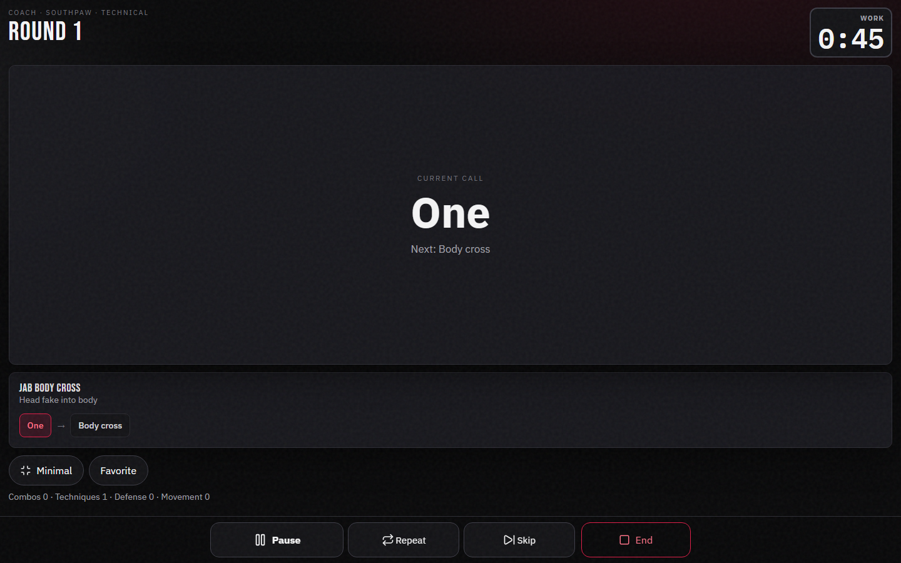
</p>

| Customize a workout | Daily Drill |
|---|---|
| 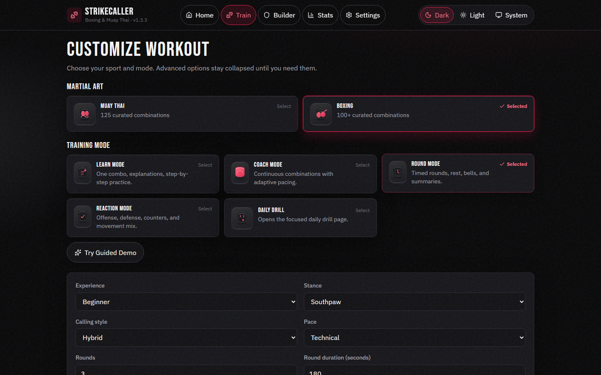 | 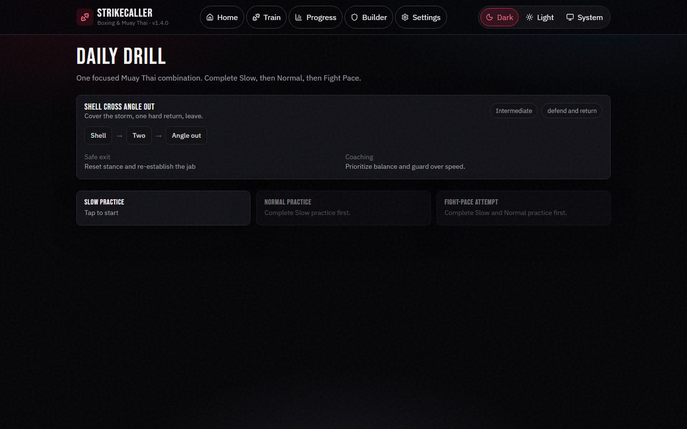 |

| Custom Combo Builder | Training Stats |
|---|---|
| 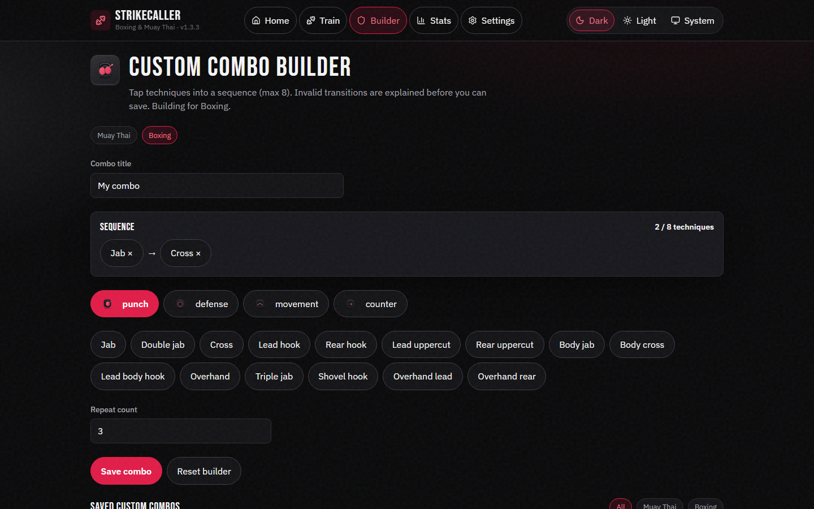 | 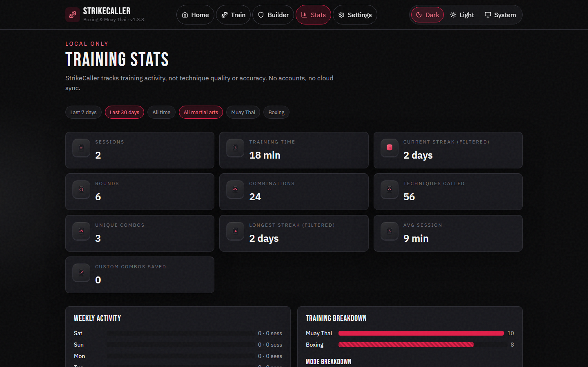 |

<p align="center">
  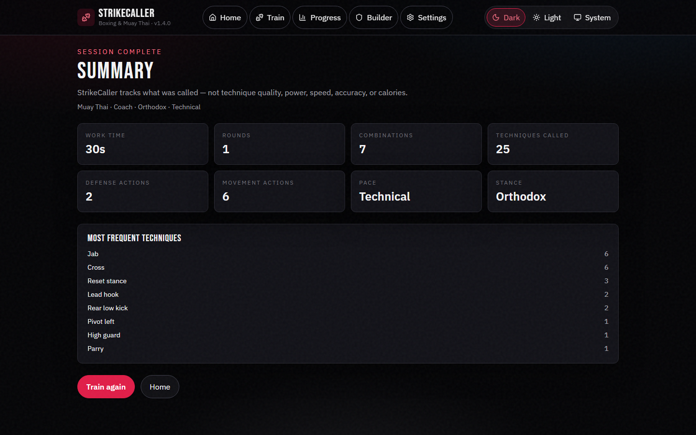
</p>

Gym-oriented Session layout (mobile):

<p align="center">
  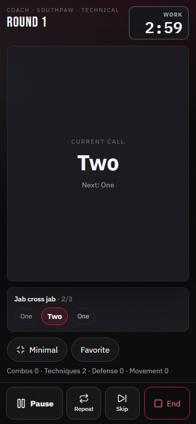
  &nbsp;
  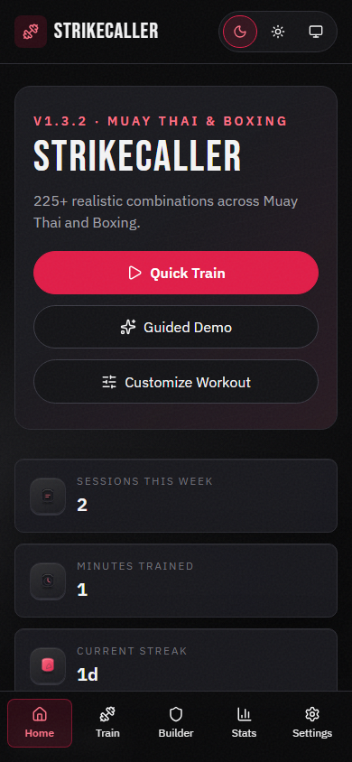
</p>

## Engineering highlights

### Session engine

Round and rest lifecycle, pause/resume, technique-aware timing, session summaries, and collision-resistant session IDs (`session-<timestamp>-<entropy>`). Legacy timestamp IDs still open.

### Training generation

Curated combos are the primary source. A rule-based generator may only assemble techniques using explicit compatibility rules — stance, side, weight transfer, range, recovery, defensive responsibility, and exits. Difficulty and category filters stay authoritative; finite Train Again queues do not fall back to unrelated generated work.

### Local persistence

Workout history lives in IndexedDB. Preferences, favorites, custom combos, and Daily Drill state use localStorage. Imports are strictly validated. Summary routes (`#/summary/<id>`) reload from storage after refresh. Direct `#/session` without start state shows an honest unavailable screen instead of fabricating a workout.

### Audio

Web Speech for calls, Web Audio for bells and tones after a user-gesture start, visibility handling that pauses and cancels stale speech, and Screen Wake Lock ownership that does not leak overlapping requests.

## Architecture

The app is a client-only browser application. There is no StrikeCaller server.

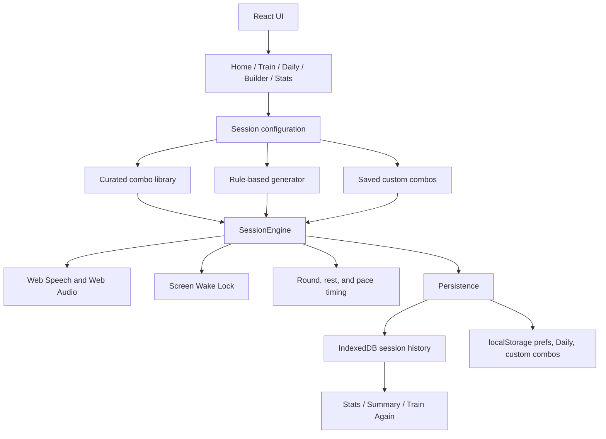

Production delivery on `main`:

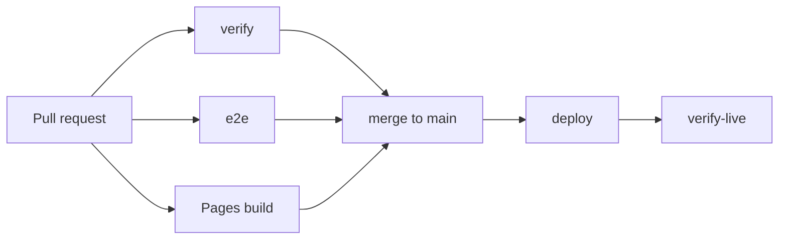

Pull requests run verify, e2e, and Pages build. Deploy and live verification run only on `main`.

## Reliability and testing

v1.4.0 local gate evidence:

- **722** Vitest tests across **47** files
- **86** Playwright tests passed, **36** skipped, **0** failed
- Chromium, Firefox, WebKit, and mobile WebKit
- lint, typecheck, unit/integration tests, Pages artifact verification, E2E, deploy, and post-deploy `verify-live`

These counts describe a specific build. They are not a permanent guarantee.

Selected hardening (see [CHANGELOG.md](./CHANGELOG.md) for the full history):

- Collision-resistant session IDs; existing timestamp-based summary links remain valid
- Strict imports reject duplicate session and custom-combo identities before writes
- Direct or malformed `/session` routes do not fabricate a default workout
- Generator filters remain authoritative across curated, generated, and fallback paths
- Daily Drill phases stay attached to the civil date they started, including midnight crossings
- Daily Drill pages refresh on local date change so a stale post-midnight click cannot start a different combo
- Session finalization uses a dedicated finishing state; Back cannot yank the user to Summary after leaving
- Saved Minimal Mode, timing multipliers, and Builder custom pace apply across workout entry points
- Export can recover valid in-tab state after a failed durable write; implausible future history is rejected or excluded
- Guarded primary actions recover after synchronous throws or rejected async work
- Wake-lock request ownership does not leak overlapping or stale releases

## Local-first privacy

- No account
- No backend
- Privacy-first anonymous site analytics for site-level traffic
- No cookies added by StrikeCaller
- No advertising
- No cloud sync
- Training data stays in browser storage (IndexedDB + localStorage)
- StrikeCaller does not send workout contents, custom combos, preferences, history, or user-entered information to analytics

Cloudflare Web Analytics is optional. The app works if that script is blocked or offline.

Fonts are bundled with the app. The UI does not depend on `fonts.googleapis.com` at runtime.

## PWA / offline behavior

Home-screen install uses the web manifest (`display: standalone`) plus a production service worker.

After one successful online load, a later visit can use the cached application shell and local training features without internet: Home, Train, Builder, Daily, Stats, Settings, session launch, captions, local tones, completion, Summary, and history.

Limits:

- Browser/OS text-to-speech voices are **not** guaranteed offline. If speech cannot run, the workout continues and captions stay truthful.
- Waiting service workers do not skip waiting, so an active workout is not reloaded because a newer build exists.
- Local data does not live in Cache Storage. Clearing site cache does not delete workout history.

See [docs/physical-device-release-checklist.md](./docs/physical-device-release-checklist.md) for device install checks that still need a human.

## Tech stack

React, TypeScript, Vite, React Router (`HashRouter`), IndexedDB, localStorage, Web Speech API, Web Audio API, Screen Wake Lock API, Workbox via `vite-plugin-pwa`, Vitest, Testing Library, Playwright, GitHub Actions, GitHub Pages.

## Training system

Combinations are curated first and generated second.

- Curated combos are manually reviewable structured data
- The generator may only assemble techniques using explicit compatibility rules
- Sequences respect stance, side, weight transfer, range, recovery, defensive responsibility, and exits
- Beginner work stays simple and repeatable; advanced work adds layers, not empty length

Most combinations contain 2–5 offensive techniques, with optional defense and movement.

| Mode | Behavior |
|------|----------|
| **Names** | “Jab, cross, rear low kick” |
| **Numbers** | Boxing numbers `1–6` where clear; Muay Thai techniques keep short named calls |
| **Hybrid** | “One, two, lead hook, rear low kick” |

Numbers are never forced onto techniques where numbering would confuse the athlete.

Pace presets: Learn · Slow · Technical · Normal · Fast · Fight pace · Custom. Unsafe or unusably fast timing is clamped.

Orthodox and southpaw are first-class. Technique language stays lead/rear by default, with optional left/right. Movement directions mirror for southpaw.

Technique library: punches, kicks, teeps, knees, elbows, defense, movement, counters, and clinch — each with timing, range, difficulty, follow-up rules, and safety notes where appropriate.

## Browser and device support

- Best on current Chrome, Edge, Firefox, and Safari
- Spoken calls use the Web Speech API when available; captions and tones remain usable when speech is unsupported
- Round bells and countdown tones use the Web Audio API after a user gesture starts a session
- Vibration and screen wake lock are optional and device-dependent
- Voice quality depends on voices installed in the browser/OS
- Add to Home Screen uses the web manifest; offline app-shell use requires a successful first online load

## Run locally

```bash
npm ci
npm run dev
```

Other scripts:

```bash
npm run lint
npm run typecheck
npm test
npm run test:e2e
npm run build
npm run build:pages
npm run verify:pages
npm run verify:release
npm run preview
```

`npm run verify:release` is the local equivalent of the production lint / typecheck / test / Pages gates (E2E is a separate `npm run test:e2e` / CI job).

Requirements: Node.js 20+ (22 LTS recommended) and a modern browser.

## Deployment

The public site is [https://manpreets2.github.io/StrikeCaller/](https://manpreets2.github.io/StrikeCaller/). GitHub Pages paths are case-sensitive.

CI (`.github/workflows/ci.yml`) runs lint, typecheck, tests, Pages build, and `verify:pages` on pull requests and on `main`. Artifact upload, deploy, and `verify-live` run only for `refs/heads/main`. Pages source must be **GitHub Actions**, not a `gh-pages` branch.

Routing uses `HashRouter` so deep links and refresh work without server rewrites (for example `https://manpreets2.github.io/StrikeCaller/#/train`). Historical release notes live in [CHANGELOG.md](./CHANGELOG.md). Visual system notes live in [docs/v1.4-ui-polish-plan.md](./docs/v1.4-ui-polish-plan.md).

## Limitations

- Does **not** evaluate technique quality, power, speed, accuracy, or calories
- **No** motion tracking
- Combinations are training drills — **not** fight-performance guarantees
- Speech voice quality is browser/OS dependent and is not guaranteed offline
- Wake lock and vibration support vary by device
- Clinch, elbows, and some knee work need appropriate equipment or coaching; the app warns or filters where practical

v1.4 supports Boxing and Muay Thai. That is the complete product.

## Safety

Warm up. Use appropriate equipment. Keep enough clear space. Prioritize balance and control. Prefer qualified coaching. Avoid hard contact without supervision. Stop for pain, dizziness, or injury.

StrikeCaller is a training aid, not medical advice, sparring supervision, or a replacement for a coach.

## Post-v1 ideas / maintenance

Possible later investigations (not committed for a timeline):

- Multi-tab UI synchronization
- Physical-device follow-up after install and offline relaunch on specific phones

## Author

**Manpreet Singh**  
Computer Science Student at De Anza College

Built as a portfolio project exploring browser application engineering, adaptive audio coaching, structured combat-sport data, rule-based generation, reliability, and accessible workout UX.

## License

MIT
